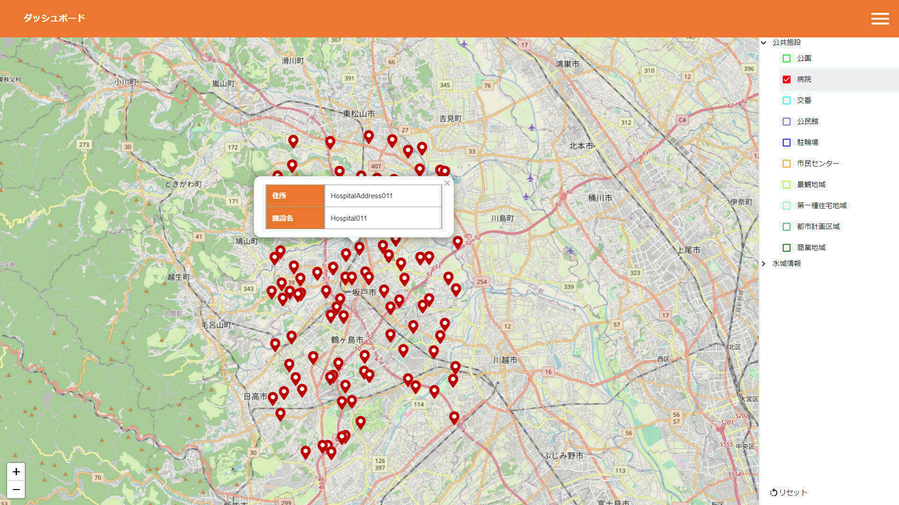

# StarSeeker - FIWAREのデータを様々な形式で表示・管理が行えるプラットフォーム



[English README is here](README_en.md)

## 構成図


## 目次

- [StarSeeker - FIWAREのデータを様々な形式で表示・管理が行えるプラットフォーム](#starseeker---fiwareのデータを様々な形式で表示管理が行えるプラットフォーム)
  - [目次](#目次)
  - [本プロジェクトについて](#本プロジェクトについて)
  - [StarSeekerの始め方 クイックスタート](#starseekerの始め方-クイックスタート)
    - [概要](#概要)
    - [インストール方法](#インストール方法)
    - [基本的な使い方](#基本的な使い方)
      - [管理者向け](#管理者向け)
      - [利用者向け](#利用者向け)
      - [アプリケーション停止方法](#アプリケーション停止方法)
  - [機能](#機能)
    - [管理機能](#管理機能)
    - [利用者機能](#利用者機能)
  - [利用バージョン](#利用バージョン)

## 本プロジェクトについて

基盤ソフトウェア「[FIWARE](https://www.fiware.org/)」([ファイウェア](https://www.fiware.org/))で蓄積されたデータを、自由に、様々な形式で表示・管理を行うことで、スマートシティを実現するプラットフォーム。

## StarSeekerの始め方 クイックスタート
 
### 概要

- docker-composeで提供しております。
- docker-compose 1.16.1, docker 20.10.7 をインストール済みのUbuntu 20.04上で動作確認しております。

### インストール方法

- git clone
- 作業ディレクトリに移動

  ```
  ~/StarSeeker$ cd StarSeeker
  ```

- MongoDBとPostgreSQLのユーザ、パスワードおよび地図の初期パラメータ値(緯度、経度、ズーム値)を.envに設定

  ```
  ~/StarSeeker/StarSeeker$ cp _env .env
  ~/StarSeeker/StarSeeker$ vi .env # MongoDB、PostgreSQLのアカウントと地図の初期パラメータ値を設定
  ```

- Dockerコンテナを展開

  ```
  ~/StarSeeker/StarSeeker$ docker-compose up -d
  ```

- データ管理端末コンテナで使う管理データ格納ディレクトリworkを作成(samplesをコピー)

  ```
  ~/StarSeeker/StarSeeker$ cd operator
  ~/StarSeeker/StarSeeker/operator$ cp -r samples work
  ```

- 管理データ格納ディレクトリにてデータモデルおよびデータを編集(それぞれかわりにcsvを用意してもよい)
  - データモデルテーブル定義ファイル: tables.xlsx
  - データカテゴリ定義ファイル(サンプル): category.xlsx
  - 点データセット定義およびデータファイル(サンプル): point.xlsx
  - 面データセット定義およびデータファイル(サンプル): surface.xlsx

- データ管理端末コンテナに.envを共有しdockerネットワークに追加

  ```
  ~/StarSeeker/StarSeeker/operator$ ln -s ../.env .env
  ~/StarSeeker/StarSeeker/operator$ docker-compose up -d
  ```

- 以下はdocker execにてデータ管理端末コンテナ(op)上にて作業実施
  ```
  ~/StarSeeker/StarSeeker/operator$ docker exec -it op /bin/bash
  root@op:/work# 
  ```

- データソースとしてそのままxlsxファイルを使っている場合は、各xlsxファイルからcsvを取り出す
  ```
  root@op:/work# ./xlsx2csv-all.sh
  ```

### 地図のカテゴリとデータセット定義の投入

- RDB (postgres)に地図カテゴリ定義を投入

  ```
  root@op:/work# ss_conductor category create tables.csv category.csv # DMLを確認
  root@op:/work# ss_conductor category create tables.csv category.csv --send $DSN # RDBに投入
  ```

- RDB (postgres)に地図データセット定義を投入

  ```
  root@op:/work# ss_conductor dataset create tables.csv point.csv # DMLを確認
  root@op:/work# ss_conductor dataset create tables.csv point.csv --send $DSN # RDBに投入
  ```

- データモデルが生成されたことを以下のいずれかで確認(ハンバーガーメニューからデータセット選択可能となる)
  - ブラウザで http://Dockerホスト名:3000 に接続

### データの投入と更新

- データをorionに投入(環境変数$BROKERはdocker-composeで設定済み)

  ```
  root@op:/work# ss_conductor data create tables.csv point_data.csv # メッセージを確認
  root@op:/work# ss_conductor data create tables.csv point_data.csv --send $BROKER # Brokerに投入
  ```

- データが投入されていることを以下のいずれかで確認
  - ブラウザで http://Dockerホスト名:4000 に接続
  - データ管理用コンテナからorionにクエリを投げる(Dockerホストにはポートを公開していない)

    ```
    root@op:/work# curl -s http://orion:1026/v2/entities?limit=500
    root@op:/work# curl -s http://orion:1026/v2/entities?limit=500 | python -c '\
    import pprint;\
    import json;\
    import sys;\
    pprint.pprint(json.loads(sys.stdin.read()))' # 結果を見やすく整形
    ```

### 投入したデータの削除

- データをorionから削除

  ```
  root@op:/work# ss_conductor data delete tables.csv point_data.csv # メッセージを確認
  root@op:/work# ss_conductor data delete tables.csv point_data.csv --send $BROKER # Brokerに投入
  ```

### 地図のカテゴリとデータセット定義の削除

- RDB (postgres)から地図データセット定義を削除

  ```
  root@op:/work# ss_conductor dataset delete tables.csv point.csv # DMLを確認
  root@op:/work# ss_conductor dataset delete tables.csv point.csv --send $DSN # RDBに投入
  ```

- RDB (postgres)から地図カテゴリ定義を削除

  ```
  root@op:/work# ss_conductor category delete tables.csv category.csv # DMLを確認
  root@op:/work# ss_conductor category delete tables.csv category.csv --send $DSN # RDBに投入
  ```

### 基本的な使い方

#### 管理者向け

- 管理DBへの反映方法
  - カラム情報<br>
    [テーブル構成を参照](docs/DB_TABLE.md)

  - 詳細情報のフィールド名とFIWARE Orionとの対応づけ
    - location(位置情報)とtime(登録時刻)を除く要素名を詳細情報テーブルに追加
      - FIWARE Orion エンティティ サンプル例
        ```
        {
          "id": "ParkId001",
          "type": "Park",
          "address": {  ※詳細表示テーブル紐づけ対象
            "type": "Text",
            "value": "ParkAddress001",
            "metadata": {}
          },
            "location": {
              "type": "geo:point",
              "value": "35.9045568476736, 139.378167943858",
              "metadata": {}
            },
            "locationName": {  ※詳細表示テーブル紐づけ対象
            "type": "Text",
            "value": "Park001",
            "metadata": {}
            },
            "time": {
            "type": "DateTime",
            "value": "2021-08-23T15:00:00.000Z",
            "metadata": {}
            }
        }
        ```
        
        - PostgreSQL 詳細表示テーブル サンプル例
        ```
        postgres=# select * from t_point_detail where point_dataset_id = 1;
        point_detail_id  | point_dataset_id | display_order | item_attr_name | data_type | enabled | display_title
        -----------------+------------------+---------------+----------------+-----------+---------+---------------
                       1 |                1 |             1 | address        |         0 | t       | 住所
                       2 |                1 |             1 | locationName   |         0 | t       | 施設名
        ```

        - Web画面 詳細表示 サンプル例<br>
          

    - `ss_conductor`を使えばCSVをメンテナンスするだけで簡単にORIONへのデータ反映をおこなうことができます。詳細は[StarSeeker/operatorのドキュメント](StarSeeker/operator/README.md)を参照ください。

#### 利用者向け

- ブラウザから http://Dockerホスト名:3000 でアクセスできます。

- カテゴリの選択
  - 右端のハンバーガーメニューをクリックします。
  
  - 「データセット」をクリックします。
  
  - カテゴリ一覧が表示されることを確認します。
  
- データセットの選択
  - カテゴリ内に格納されているデータセットにチェックを付けます。
  
  - チェック後、ピンが表示されたことを確認します。
  
- 詳細情報の表示
  - ピンをクリックすると詳細情報が表示されます。<br>
  

#### アプリケーション停止方法

- データ管理用コンテナ、その他のコンテナの順にコンテナを停止

  ```
  ~/StarSeeker/StarSeeker/operator$ docker-compose down
  ~/StarSeeker/StarSeeker/operator$ cd ..
  ~/StarSeeker/StarSeeker/$ docker-compose down
  ```

## 利用バージョン

- [next 11.1.0](https://nextjs.org/)
- [react 17.0.2](https://ja.reactjs.org/)
- [typescript 4.3.5](https://www.typescriptlang.org/)
- [eslint 7.32.0](https://eslint.org/)
- [prettier 2.3.2](https://prettier.io/)
- [nestjs 8.0.0](https://nestjs.com/)
- [jest 27.0.6](https://jestjs.io/ja/)
- [Postgresql 13.3](https://www.postgresql.org/)
- [FIWARE Cygnus 2.11.0](https://fiware-cygnus.readthedocs.io/en/master/index.html)
- [FIWARE Orion 3.1.0](https://fiware-orion.readthedocs.io/en/master/index.html)
- [mongoDB 4.4.7](https://www.mongodb.com/)
- [node 16.0.0](https://nodejs.org/ja/about/releases/)

## ライセンス

- [AGPL-3.0](https://github.com/mkyutani/StarSeeker/blob/main/LICENSE)
