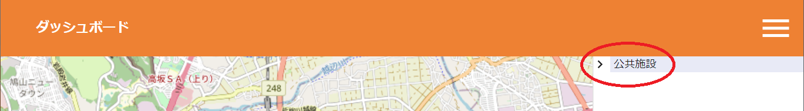
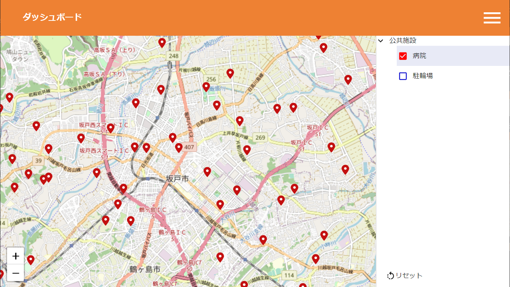

# StarSeeker - FIWAREのデータを様々な形式で表示・管理が行えるプラットフォーム


[English README is here](README_en.md)

## 構成図


## 目次

- [StarSeeker - FIWAREのデータを様々な形式で表示・管理が行えるプラットフォーム](#starseeker---fiwareのデータを様々な形式で表示管理が行えるプラットフォーム)
  - [目次](#目次)
  - [本プロジェクトについて](#本プロジェクトについて)
  - [StarSeekerの始め方 クイックスタート](#starseekerの始め方-クイックスタート)
    - [概要](#概要)
    - [インストール方法](#インストール方法)
    - [基本的な使い方](#基本的な使い方)
      - [管理者向け](#管理者向け)
      - [利用者向け](#利用者向け)
      - [アプリケーション停止方法](#アプリケーション停止方法)
  - [機能](#機能)
    - [管理機能](#管理機能)
    - [利用者機能](#利用者機能)
  - [利用バージョン](#利用バージョン)

## 本プロジェクトについて

基盤ソフトウェア「[FIWARE](https://www.fiware.org/)」([ファイウェア](https://www.fiware.org/))で蓄積されたデータを、自由に、様々な形式で表示・管理を行うことで、スマートシティを実現するプラットフォーム。

## StarSeekerの始め方 クイックスタート
 
### 概要

- docker-composeで提供しております。
- docker-compose 1.16.1, docker 20.10.7 をインストール済みのUbuntu 20.04上で動作確認しております。

### インストール方法

- git clone
- 作業ディレクトリに移動

  ```
  ~/StarSeeker$ cd StarSeeker
  ```

- MongoDBとPostgreSQLのユーザ、パスワードおよび地図の初期パラメータ値(緯度、経度、ズーム値)を.envに設定

  ```
  ~/StarSeeker/StarSeeker$ cp _env .env
  ~/StarSeeker/StarSeeker$ vi .env # MongoDB、PostgreSQLのアカウントと地図の初期パラメータ値を設定
  ```

- Dockerコンテナを展開

  ```
  ~/StarSeeker/StarSeeker$ docker-compose up -d
  ```

- データ管理端末コンテナで使う管理データ格納ディレクトリworkを作成(samplesをコピー)

  ```
  ~/StarSeeker/StarSeeker$ cd operator
  ~/StarSeeker/StarSeeker/operator$ cp -r samples work
  ```

- 管理データ格納ディレクトリにてデータモデルおよびデータを編集(それぞれかわりにcsvを用意してもよい)
  - テナント定義: tenant.xlsx
  - サービスパス定義: servicepath.xlsx
  - データカテゴリ定義: category.xlsx
  - 点データセット定義およびデータ: point.xlsx
  - 面データセット定義およびデータ: surface.xlsx

- データ管理端末コンテナに.envを共有しdockerネットワークに追加

  ```
  ~/StarSeeker/StarSeeker/operator$ ln -s ../.env .env
  ~/StarSeeker/StarSeeker/operator$ docker-compose up -d
  ```

- 以下はdocker execにてデータ管理端末コンテナ(op)上にて作業実施

  ```
  ~/StarSeeker/StarSeeker/operator$ docker exec -it op /bin/bash
  root@op:/work# 
  ```

- 必要があれば各xlsxファイルからcsvを取り出す

  ```
  root@op:/work# ./xlsx2csv-all.sh
  ```

### テナント、サービスパス、カテゴリとデータセット定義の投入

下記のコマンド例に関して、変数`$DSN`と変数`$BROKER`はdocker-compose.ymlにて初期設定済み

- RDB (postgres)にテナント定義を投入

  ```
  root@op:/work# ss_conductor tenant create tenant.csv # DMLを確認
  root@op:/work# ss_conductor tenant create tenant.csv --send $DSN # RDBに投入
  ```

- RDB (postgres)にサービスパス定義を投入

  ```
  root@op:/work# ss_conductor servicepath create servicepath.csv # DMLを確認
  root@op:/work# ss_conductor servicepath create servicepath.csv --send $DSN # RDBに投入
  ```

- RDB (postgres)に地図カテゴリ定義を投入

  ```
  root@op:/work# ss_conductor category create category.csv # DMLを確認
  root@op:/work# ss_conductor category create category.csv --send $DSN # RDBに投入
  ```

- RDB (postgres)に地図データセット定義を投入

  ```
  root@op:/work# ss_conductor dataset create point.csv # DMLを確認
  root@op:/work# ss_conductor dataset create point.csv --send $DSN # RDBに投入
  ```

- データモデルが生成されたことを以下のいずれかで確認(ハンバーガーメニューからデータセット選択可能となる)
  - ブラウザで http://Dockerホスト名:3000 に接続

### データの投入と更新

- データをorionに投入

  ```
  root@op:/work# ss_conductor data create point_data.csv # メッセージを確認
  root@op:/work# ss_conductor data create point_data.csv --send $BROKER # Brokerに投入
  ```

- データが投入されていることを以下のいずれかで確認

  - データ管理用コンテナからorionにクエリを投げる(Dockerホストにはポートを公開していない)

    ```
    root@op:/work# curl -s http://orion:1026/v2/entities?limit=500
    root@op:/work# curl -s http://orion:1026/v2/entities?limit=500 | python -c '\
    import pprint;\
    import json;\
    import sys;\
    pprint.pprint(json.loads(sys.stdin.read()))' # 結果を見やすく整形
    ```

### 画像の登録

- フロンエンドサーバに画像をコピー

  ```
  ~/StarSeeker/StarSeeker$ cp operator/samples/img/* site/frontend/public/img
  ```

## データの削除

### 画像の削除

- フロントエンドサーバにコピーした画像を削除

  ```
  ~/StarSeeker/StarSeeker$ rm site/frontend/public/img/*
  ```

### 投入したデータの削除

- データをorionから削除

  ```
  root@op:/work# ss_conductor data delete point_data.csv # メッセージを確認
  root@op:/work# ss_conductor data delete point_data.csv --send $BROKER # Brokerに投入
  ```

### テナント、サービスパス、カテゴリとデータセット定義の削除

- RDB (postgres)から地図データセット定義を削除

  ```
  root@op:/work# ss_conductor dataset delete point.csv # DMLを確認
  root@op:/work# ss_conductor dataset delete point.csv --send $DSN # RDBに投入
  ```

- RDB (postgres)から地図カテゴリ定義を削除

  ```
  root@op:/work# ss_conductor category delete category.csv # DMLを確認
  root@op:/work# ss_conductor category delete category.csv --send $DSN # RDBに投入
  ```

- RDB (postgres)からサービスパス定義を削除

  ```
  root@op:/work# ss_conductor servicepath delete servicepath.csv # DMLを確認
  root@op:/work# ss_conductor servicepath delete servicepath.csv --send $DSN # RDBに投入
  ```

- RDB (postgres)からテナント定義を削除

  ```
  root@op:/work# ss_conductor tenant delete tenant.csv # DMLを確認
  root@op:/work# ss_conductor tenant delete tenant.csv --send $DSN # RDBに投入
  ```

### 基本的な使い方

#### 管理者向け

- 管理DBへの反映方法

  - `ss_conductor`はCSVから管理データベースおよびORIONへのデータ反映をおこなうことができます。詳細は[StarSeeker/operatorのドキュメント](StarSeeker/operator/README.md)を参照ください。

- マルチテナント、サービスパス機能

  - ORIONには[マルチテナント](https://fiware-orion.letsfiware.jp/user/multitenancy/)および[エンティティ・サービスパス](https://fiware-orion.letsfiware.jp/user/service_path/)(サービスパス)という機能があります。StarSeekerでもフロントエンドにて同様の制御をおこなうことができます。
  - フロントエンドサーバは、管理DBのテナント(`T_TETNANT`)、サービスパス(`T_SERVICE_PATH`)にテナントとサービスパスに登録された組合せに従ってカテゴリ、データセット、データ(Orionから取得)を返します。
  - 利用者がブラウザからアクセスしたおきにデフォルトではテナント`NULL`、サービスパス`NULL`の情報が表示されます。テナントとサービスパスはhttpヘッダーの`fiware-service`と`fiware-servicepath`に対応しますが、通常ブラウザの基本機能ではヘッダーを追加できません。したがって、この機能を利用する際には、フロントエンドブラウザの前にリバースプロキシなどを設置し、アクセス先ホスト名に応じてヘッダを追加してStarSeekerに渡すといった工夫が必要になるでしょう。

#### 利用者向け

- ブラウザから http://Dockerホスト名:3000 でアクセスします。
  

- カテゴリの選択
  - 右端のハンバーガーメニューをクリックします。
  
  - 登録されているカテゴリが一覧表示されていることを確認し、カテゴリをクリックしてツリーを開きます。
  
- データセットの選択
  - カテゴリのツリーに表示されるデータセットのうち表示したいデータセットにチェックを付けます。
  
  - チェック後、ピンが表示されたことを確認します。
  

- 詳細情報の表示
  - ピンをクリックすると詳細情報が表示されます。<br>
  

#### アプリケーション停止方法

- データ管理用コンテナ、その他のコンテナの順にコンテナを停止

  ```
  ~/StarSeeker/StarSeeker/operator$ docker-compose down
  ~/StarSeeker/StarSeeker/operator$ cd ..
  ~/StarSeeker/StarSeeker/$ docker-compose down
  ```

## 利用バージョン

- [next 12.1.6](https://nextjs.org/)
- [react 18.1.0](https://ja.reactjs.org/)
- [typescript 4.7.3](https://www.typescriptlang.org/)
- [eslint 8.17.0](https://eslint.org/)
- [prettier 2.6.2](https://prettier.io/)
- [nestjs 8.0.0](https://nestjs.com/)
- [jest 27.0.6](https://jestjs.io/ja/)
- [Postgresql 16.1](https://www.postgresql.org/)
- [FIWARE Cygnus 2.15.0](https://fiware-cygnus.readthedocs.io/en/master/index.html)
- [FIWARE Orion 3.10.1](https://fiware-orion.readthedocs.io/en/master/index.html)
- [mongoDB 6.0.12](https://www.mongodb.com/)
- [node 20.10.0](https://nodejs.org/ja/about/releases/)

## ライセンス

- [AGPL-3.0](LICENSE)
