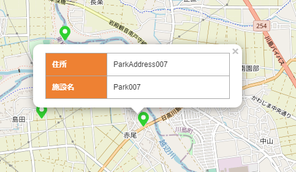
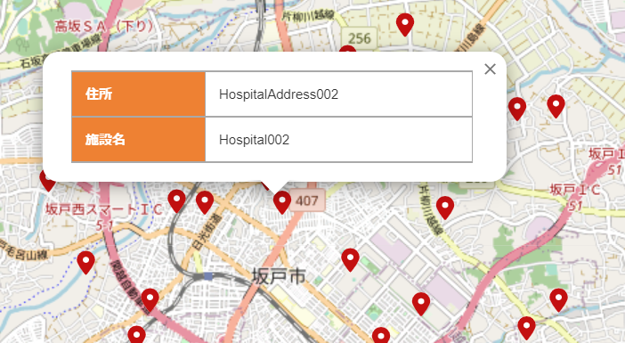

# StarSeeker - FIWAREのデータを様々な形式で表示・管理が行えるプラットフォーム


アーキテクチャ図 TBD

[English README is here](README_en.md)

## 目次

- [StarSeeker - FIWAREのデータを様々な形式で表示・管理が行えるプラットフォーム](#starseeker---fiwareのデータを様々な形式で表示管理が行えるプラットフォーム)
  - [目次](#目次)
  - [本プロジェクトについて](#本プロジェクトについて)
  - [StarSeekerの始め方 クイックスタート](#starseekerの始め方-クイックスタート)
    - [概要](#概要)
    - [インストール方法](#インストール方法)
    - [サンプルデータの投入方法](#サンプルデータの投入方法)
    - [基本的な使い方](#基本的な使い方)
      - [管理者向け](#管理者向け)
      - [アプリケーション起動方法](#アプリケーション起動方法)
      - [利用者向け](#利用者向け)
  - [機能](#機能)
    - [管理機能](#管理機能)
    - [利用者機能](#利用者機能)
  - [利用バージョン](#利用バージョン)

## 本プロジェクトについて

基盤ソフトウェア「[FIWARE](https://www.fiware.org/)」([ファイウェア](https://www.fiware.org/))で蓄積されたデータを、自由に、様々な形式で表示・管理を行うことで、スマートシティを実現するプラットフォーム。

## StarSeekerの始め方 クイックスタート
 
### 概要

- docker-composeで提供しております。
- docker-compose 1.16.1, docker 20.10.7 をインストール済みのUbuntu 20.04上で動作確認しております。

### インストール方法

- npmのインストール
  ```
  sudo apt-get install nodejs
  sudo apt-get install npm
  ```

- Dockerコンテナを展開

  ```
  git clone https://github.com/c-3lab/StarSeeker
  cd StarSeeker/install
  vi .env ※MongoDBとPostgreSQLのパスワードを指定
  docker-compose up -d
  ```

- 管理DBのテーブルを作成

  ```
  cd StarSeeker/install
  sudo apt-get install postgresql-client-common postgresql-client
  psql -h localhost -p 5432 -U postgres -d postgres -f managedb.sql
  ```

### サンプルデータの投入方法

シェルスクリプトを実行し、サンプルデータを追加します。

```
cd StarSeeker/install
chmod 755 add_sampledata.sh
./add_sampledata.sh
```

サンプルデータ追加後、下記のコマンドを実行してデータが入っていることを確認します。

```
sudo apt-get install jq
curl http://localhost:1026/v2/entities?limit=500 | jq .
```

管理DBのサンプルデータを追加致します。
```
cd StarSeeker/install
sudo apt-get install postgresql-client-common postgresql-client
psql -h localhost -p 5432 -U postgres -d postgres -f sampledata.sql
```

### 基本的な使い方

#### 管理者向け

- 管理DBへの反映方法
  - カラム情報<br>
    [テーブル構成を参照](docs/DB_TABLE.md)

  - 詳細情報のフィールド名とFIWARE Orionとの対応づけ
    - location(位置情報)とtime(登録時刻)を除く要素名を詳細情報テーブルに追加
      - FIWARE Orion エンティティ サンプル例
        ```
        {
          "id": "ParkId001",
          "type": "Park",
          "address": {  ※詳細表示テーブル紐づけ対象
            "type": "Text",
            "value": "ParkAddress001",
            "metadata": {}
          },
            "location": {
              "type": "geo:point",
              "value": "35.9045568476736, 139.378167943858",
              "metadata": {}
            },
            "locationName": {  ※詳細表示テーブル紐づけ対象
            "type": "Text",
            "value": "Park001",
            "metadata": {}
            },
            "time": {
            "type": "DateTime",
            "value": "2021-08-23T15:00:00.000Z",
            "metadata": {}
            }
        }
        ```
        
        - PostgreSQL 詳細表示テーブル サンプル例
        ```
        postgres=# select * from t_point_detail where point_dataset_id = 1;
        point_detail_id  | point_dataset_id | display_order | item_attr_name | data_type | enabled | display_title
        -----------------+------------------+---------------+----------------+-----------+---------+---------------
                       1 |                1 |             1 | address        |         0 | t       | 住所
                       2 |                1 |             1 | locationName   |         0 | t       | 施設名
        ```

        - Web画面 詳細表示 サンプル例<br>
          


  - FIWARE Orionへの追加方法
    - [FIWARE Orion GitHub](https://github.com/telefonicaid/fiware-orion/)を参照しNGSIv2 APIに適合したJSONを新規作成
    - `http://localhost:1026/v2/entities`宛にエンティティを追加([サンプル実行コマンドを参照](docs/SAMPLE_ENTITY.md))
  - 管理DBへのデータ追加方法
    - カラム情報に登録されている値に倣い管理DBにデータを追加([サンプル実行コマンドを参照](docs/SAMPLE_DB.md))


#### アプリケーション起動方法

アプリケーションインストールスクリプトを実行します。
```
cd install/
chmod 755 start_application.sh
./start_application.sh
```

#### 利用者向け

- ブラウザから http://localhost:3000 でアクセスできます。

- カテゴリの選択
  - 右端のハンバーガーメニューをクリックします。
  
  - 「データセット」をクリックします。
  
  - カテゴリ一覧が表示されることを確認します。
  
- データセットの選択
  - カテゴリ内に格納されているデータセットにチェックを付けます。
  
  - チェック後、ピンが表示されたことを確認します。
  
- 詳細情報の表示
  - ピンをクリックすると詳細情報が表示されます。<br>
  

## 機能

### 管理機能

- FIWARE Orionに格納されているデータセットのカテゴライズ
- FIWARE Orionに格納されてている点または面データに詳細情報を紐付ける

### 利用者機能

- 地図の表示
  - 拡大縮小
  - スクロール
- 表示したいカテゴリを選択
- 選択したカテゴリに属しているデータセットから、任意のデータセットを選択を選択し、そのデータセットに含まれる点または面データを地図上に表示
- 詳細情報が存在する点または面データをタップ時に、ポップアップで詳細情報を表示

## 利用バージョン

- [next 11.1.0](https://nextjs.org/)
- [react 17.0.2](https://ja.reactjs.org/)
- [typescript 4.3.5](https://www.typescriptlang.org/)
- [eslint 7.32.0](https://eslint.org/)
- [prettier 2.3.2](https://prettier.io/)
- [nestjs 8.0.0](https://nestjs.com/)
- [jest 27.0.6](https://jestjs.io/ja/)
- [Postgresql 13.3](https://www.postgresql.org/)
- [FIWARE Cygnus 2.11.0](https://fiware-cygnus.readthedocs.io/en/master/index.html)
- [FIWARE Orion 3.1.0](https://fiware-orion.readthedocs.io/en/master/index.html)
- [mongoDB 4.4.7](https://www.mongodb.com/)
- [node 16.0.0](https://nodejs.org/ja/about/releases/)
