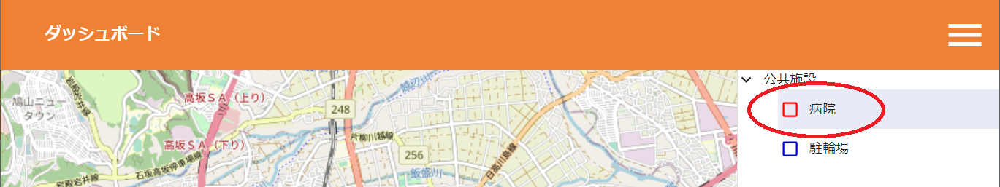

# StarSeeker - A platform for displaying and managing FIWARE data in a variety of formats


[日本語版READMEはこちら](README.md)

## Architecture


## Table of Contents

- [StarSeeker - A platform for displaying and managing FIWARE data in a variety of formats](#starseeker---a-platform-for-displaying-and-managing-fiware-data-in-a-variety-of-formats)
  - [Table of Contents](#table-of-contents)
  - [About this project](#about-this-project)
  - [Getting started with StarSeeker quick start](#getting-started-with-starseeker-quick-start)
    - [Overview](#overview)
    - [How to install](#how-to-install)
    - [How to input sample data](#how-to-input-sample-data)
    - [Basic usage](#basic-usage)
      - [For Administrators](#for-administrators)
      - [How to start the application](#how-to-start-the-application)
      - [For Users](#for-users)
      - [How to stop the application](#how-to-stop-the-application)
  - [Function](#function)
    - [Management function](#management-function)
    - [User facility](#user-facility)
  - [Version used](#version-used)

## About this project

A platform for realizing smart cities by freely displaying and managing data stored in the underlying software "[FIWARE](https://www.fiware.org/)" in a variety of formats.

## Getting started with StarSeeker quick start
 
### Overview

- It is provided by docker-compose.
- It has been tested on Ubuntu 20.04 with docker-compose 1.16.1 and docker 20.10.7 installed.

### How to install

- git clone
- Change work directory.

  ```
  ~/StarSeeker$ cd StarSeeker
  ```

- Configure some parameters in .env.

  - MongoDB user and password
  - PostgreSQL user and password
  - Initial parameters for maps (longitude, latitude, zoom value)

    ```
    ~/StarSeeker/StarSeeker$ cp _env .env
    ~/StarSeeker/StarSeeker$ vi .env # Congire parameters by your favorite editor :-)
    ```

- Start containers.

  ```
  ~/StarSeeker/StarSeeker$ docker-compose up -d
  ```

- Create a working directory for an operator terminal and copy from samples.

  ```
  ~/StarSeeker/StarSeeker$ cd operator
  ~/StarSeeker/StarSeeker/operator$ cp -r samples work
  ```

- Edit the management tables and data csv's.
  - Tenant definitions: tenant.xlsx
  - Service path definitions: servicepath.xlsx
  - Data category definitions: category.xlsx
  - Point dataset definitions and data: point.xlsx
  - Surface dataset definitions and data: surface.xlsx

- Share .env and start the operator terminal.

  ```
  ~/StarSeeker/StarSeeker/operator$ ln -s ../.env .env
  ~/StarSeeker/StarSeeker/operator$ docker-compose up -d
  ```

- Enter the operator terminal container.

  ```
  ~/StarSeeker/StarSeeker/operator$ docker exec -it op /bin/bash
  root@op:/work# 
  ```

- Convert *.xlsx to *.csv, if necessarily.

  ```
  root@op:/work# ./xlsx2csv-all.sh
  ```

### Register tenant, service path, category, and dataset definitions in management database

Note: Environment variables `$DSN` and `$BROKER` are already defined by docker-compose.

- Register tenant defitions.

  ```
  root@op:/work# ss_conductor tenant create tenant.csv # dry-run
  root@op:/work# ss_conductor tenant create tenant.csv --send $DSN # register definitions
  ```

- Register service path definitions.

  ```
  root@op:/work# ss_conductor servicepath create servicepath.csv # dry-run
  root@op:/work# ss_conductor servicepath create servicepath.csv --send $DSN # register definitions
  ```

- Register category definitions.

  ```
  root@op:/work# ss_conductor category create category.csv # dry-run
  root@op:/work# ss_conductor category create category.csv --send $DSN # register definitions
  ```

- Register dataset definitions.

  ```
  root@op:/work# ss_conductor dataset create point.csv # dry-run
  root@op:/work# ss_conductor dataset create point.csv --send $DSN # register definitions
  ```

- Confirm datasets.
  - Open http://DockerHost:3000 in your browser.
  - Categories and datasets are selectable in hamburger menu.

- Register data in orion.

  ```
  root@op:/work# ss_conductor data create point_data.csv # dry-run
  root@op:/work# ss_conductor data create point_data.csv --send $BROKER # Register data
  ```

- Confirm data.

  - Http-get entities from the operator terminal. (not docker host)

    ```
    root@op:/work# curl -s http://orion:1026/v2/entities?limit=500
    root@op:/work# curl -s http://orion:1026/v2/entities?limit=500 | python -c '\
    import pprint;\
    import json;\
    import sys;\
    pprint.pprint(json.loads(sys.stdin.read()))' # pretty print by python
    ```

### Register images

- Copy images in frontend server

  ```
  ~/StarSeeker/StarSeeker$ cp operator/samples/img/* site/frontend/public/img
  ```

## Remove data

### Remove images

- Remove images in frontend server

  ```
  ~/StarSeeker/StarSeeker$ rm site/frontend/public/img/*
  ```
### Remove data in orion

- Remove data from orion

  ```
  root@op:/work# ss_conductor data delete point_data.csv # dry-run
  root@op:/work# ss_conductor data delete point_data.csv --send $BROKER # Remove data
  ```

### Remove dataset, category, service path and tenant definitions in management database

- Remove dataset definitions.

  ```
  root@op:/work# ss_conductor dataset delete point.csv # dry-run
  root@op:/work# ss_conductor dataset delete point.csv --send $DSN # remove definitions
  ```

- Remove category definitions.

  ```
  root@op:/work# ss_conductor category delete category.csv # dry-run
  root@op:/work# ss_conductor category delete category.csv --send $DSN # remove definitions
  ```

- Remove service path definitions.

  ```
  root@op:/work# ss_conductor servicepath delete servicepath.csv # dry-run
  root@op:/work# ss_conductor servicepath delete servicepath.csv --send $DSN # remove definitions
  ```

- Remove tenants definitions.

  ```
  root@op:/work# ss_conductor tenant delete tenant.csv # dry-run
  root@op:/work# ss_conductor tenant delete tenant.csv --send $DSN # remove definitions
  ```

### Basic usage

#### For Administrators

- How to reflect to the management DB

  - Use `ss_conductor` to define tenants, service paths, categories, and datasets in the management database, and to register data in Fiware orion broker.

- Multitenancy and entity service path function

  - StarSeeker supports FIWARE Orion's [multitenacy](https://fiware-orion.readthedocs.io/en/1.4.0/user/multitenancy/index.html) and [entity service path](https://fiware-orion.readthedocs.io/en/1.4.0/user/service_path/index.html) functions.
  - StarSeeker front-end server returns categories, datasets, and data from Orion related the tenant (defined in `T_TENANT`) and the service path (defined in `T_SERVICE_PATH`).
  - Because www browsers like chrome, edge and safari http-gets without tenant and service path headers, the front end server returns categories, datasets, and data for `NULL` as tenant and `NULL` as service path to them. Therefore the administrator should use a reverse proxy server that adds `fiware-service` and `fiware-servicepath` headers and fowards requests to the fron-end server.

#### For Users

- Visit http://localhost:3000 from your browser.

- Select a category.
  - Click on the hamburger menu on the far right.
  
  - Click the category.
  
- Selecting a Data Set.
  - Check the datasets stored in the category.
  
  - After checking, make sure the pin is visible.
  
- View details.
  - Click on the pin to view detailed information.<br>
  

#### How to stop the application

- Stop containers.

  ```
  ~/StarSeeker/StarSeeker/operator$ docker-compose down
  ~/StarSeeker/StarSeeker/operator$ cd ..
  ~/StarSeeker/StarSeeker/$ docker-compose down
  ```

## Versions

- [next 12.1.6](https://nextjs.org/)
- [react 18.1.0](https://ja.reactjs.org/)
- [typescript 4.7.3](https://www.typescriptlang.org/)
- [eslint 8.17.0](https://eslint.org/)
- [prettier 2.6.2](https://prettier.io/)
- [nestjs 8.0.0](https://nestjs.com/)
- [jest 27.0.6](https://jestjs.io/ja/)
- [Postgresql 16.1](https://www.postgresql.org/)
- [FIWARE Cygnus 2.15.0](https://fiware-cygnus.readthedocs.io/en/master/index.html)
- [FIWARE Orion 3.10.1](https://fiware-orion.readthedocs.io/en/master/index.html)
- [mongoDB 6.0.12](https://www.mongodb.com/)
- [node 20.10.0](https://nodejs.org/ja/about/releases/)

## LICENSE

- [AGPL-3.0](LICENSE)
