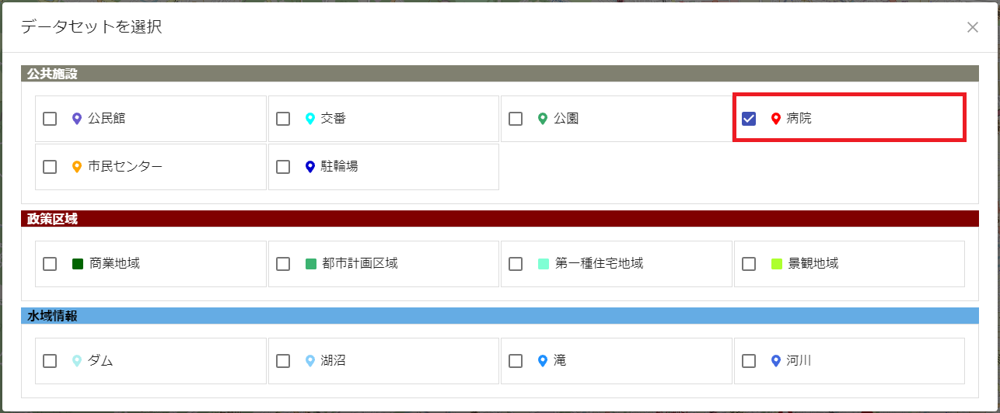

# StarSeeker - A platform for displaying and managing FIWARE data in a variety of formats


## Architecture


[日本語版READMEはこちら](README.md)

## Table of Contents

- [StarSeeker - A platform for displaying and managing FIWARE data in a variety of formats](#starseeker---a-platform-for-displaying-and-managing-fiware-data-in-a-variety-of-formats)
  - [Table of Contents](#table-of-contents)
  - [About this project](#about-this-project)
  - [Getting started with StarSeeker quick start](#getting-started-with-starseeker-quick-start)
    - [Overview](#overview)
    - [How to install](#how-to-install)
    - [How to input sample data](#how-to-input-sample-data)
    - [Basic usage](#basic-usage)
      - [For Administrators](#for-administrators)
      - [How to start the application](#how-to-start-the-application)
      - [For Users](#for-users)
      - [How to stop the application](#how-to-stop-the-application)
  - [Function](#function)
    - [Management function](#management-function)
    - [User facility](#user-facility)
  - [Version used](#version-used)

## About this project

A platform for realizing smart cities by freely displaying and managing data stored in the underlying software "[FIWARE](https://www.fiware.org/)" in a variety of formats.

## Getting started with StarSeeker quick start
 
### Overview

- It is provided by docker-compose.
- It has been tested on Ubuntu 20.04 with docker-compose 1.16.1 and docker 20.10.7 installed.

### How to install

- Install npm
  ```
  sudo apt-get install nodejs
  sudo apt-get install npm
  ```

- Deploy Docker containers

  ```
  git clone https://github.com/c-3lab/StarSeeker
  cd StarSeeker/install
  vi .env *Specify passwords for MongoDB and PostgreSQL
  docker-compose up -d
  ```

- Create a table for the management DB

  ```
  cd StarSeeker/install
  sudo apt-get install postgresql-client-common postgresql-client
  psql -h localhost -p 5432 -U postgres -d postgres -f managedb.sql
  ```

### How to input sample data

Run the shell script and add the sample data.

```
cd StarSeeker/install
chmod 755 add_sampledata.sh
./add_sampledata.sh
```

After adding the sample data, execute the following command to confirm that the data is included.

```
sudo apt-get install jq
curl http://localhost:1026/v2/entities?limit=500 | jq .
```

Sample data will be added to the management DB.

```
cd StarSeeker/install
sudo apt-get install postgresql-client-common postgresql-client
psql -h localhost -p 5432 -U postgres -d postgres -f sampledata.sql
```

### Basic usage

#### For Administrators

- How to reflect to the management DB
  - Column Information<br>
    [See Table Structure](docs/DB_TABLE.md)

  - Mapping of detailed information field names to FIWARE Orion
    - Add element names except for location and time to the detail information table.
      - FIWARE Orion Entity Sample Example
        ```
        {
          "id": "ParkId001",
          "type": "Park",
          "address": {  *Detail view table connection target
            "type": "Text",
            "value": "ParkAddress001",
            "metadata": {}
          },
            "location": {
              "type": "geo:point",
              "value": "35.9045568476736, 139.378167943858",
              "metadata": {}
            },
            "locationName": {  *Detail view table connection target
            "type": "Text",
            "value": "Park001",
            "metadata": {}
            },
            "time": {
            "type": "DateTime",
            "value": "2021-08-23T15:00:00.000Z",
            "metadata": {}
            }
        }
        ```
        
        - PostgreSQL Detail View Table Sample Example
        ```
        postgres=# select * from t_point_detail where point_dataset_id = 1;
        point_detail_id  | point_dataset_id | display_order | item_attr_name | data_type | enabled | display_title
        -----------------+------------------+---------------+----------------+-----------+---------+---------------
                       1 |                1 |             1 | address        |         0 | t       | 住所
                       2 |                1 |             1 | locationName   |         0 | t       | 施設名
        ```

        - Web Screen Sample of Detailed Display<br>
          


  - How to add to FIWARE Orion
    - Refer to [FIWARE Orion GitHub](https://github.com/telefonicaid/fiware-orion/)and create a new JSON that conforms to the NGSIv2 API.
    - Add an entity addressed to `http://localhost:1026/v2/entities`([see sample execution command](docs/SAMPLE_ENTITY.md))
  - How to add data to the management DB
    - Add data to the management DB according to the values registered in the column information([See sample execution command](docs/SAMPLE_DB.md))

#### How to start the application

Run the application installation script.

```
cd install/
chmod 755 start_application.sh
./start_application.sh
```

#### For Users

- Visit http://localhost:3000 from your browser.

- Select a category
  - Click on the hamburger menu on the far right.
  
  - Click on "Datasets".
  
  - Make sure that the category list is displayed.
  
- Selecting a Data Set
  - Check the datasets stored in the category.
  
  - After checking, make sure the pin is visible.
  
- View detailed information
  - Click on the pin to view detailed information.<br>
  

#### How to stop the application

- Take down the numbers in the PID column displayed in the execution result of the following command.

  ```
  lsof -i:3000
  lsof -i:4000
  
  (Execution example)
  $ lsof -i:3000
  COMMAND     PID   USER   FD   TYPE  DEVICE SIZE/OFF NODE NAME
  node    1091233 ubuntu   20u  IPv6 6560326      0t0  TCP *:3000 (LISTEN)

  $ lsof -i:4000
  COMMAND     PID   USER   FD   TYPE  DEVICE SIZE/OFF NODE NAME
  node    1091118 ubuntu   21u  IPv6 6560274      0t0  TCP *:4000 (LISTEN)
  ```

- Stop the application.

  ```
  kill -9 [The PID you wrote down above]
  * Please ignore the error message when executing the kill command.
  ```

## Function

### Management function

- Categorization of the datasets stored in FIWARE Orion.
- Linking detailed information to the point or surface data stored in FIWARE Orion.

### User facility

- View Map
  - Zoom in and out
  - Scroll
- Select the category you want to display
- Select any data set from the data sets belonging to the selected category, and display the point or area data contained in that data set on the map
- Display detailed information in a pop-up window when tapping a point or surface data where detailed information exists

## Version used

- [next 12.1.6](https://nextjs.org/)
- [react 18.1.0](https://ja.reactjs.org/)
- [typescript 4.7.3](https://www.typescriptlang.org/)
- [eslint 8.17.0](https://eslint.org/)
- [prettier 2.6.2](https://prettier.io/)
- [nestjs 8.0.0](https://nestjs.com/)
- [jest 27.0.6](https://jestjs.io/ja/)
- [Postgresql 13.3](https://www.postgresql.org/)
- [FIWARE Cygnus 2.11.0](https://fiware-cygnus.readthedocs.io/en/master/index.html)
- [FIWARE Orion 3.6.0](https://fiware-orion.readthedocs.io/en/master/index.html)
- [mongoDB 4.4.7](https://www.mongodb.com/)
- [node 16.15.1](https://nodejs.org/ja/about/releases/)

## LICENSE

- [AGPL-3.0](LICENSE)
